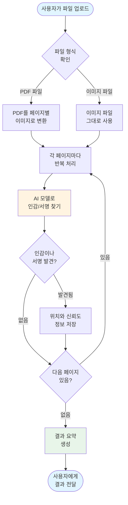
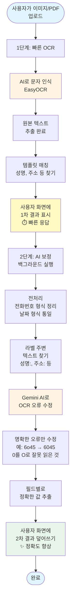
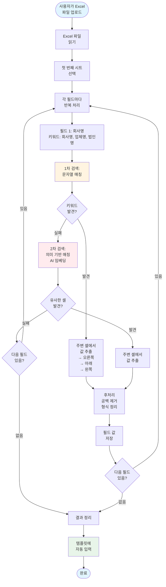

# KOICA 프로젝트 기능 작동 과정 다이어그램

이 문서는 KOICA 프로젝트에서 제공하는 세 가지 주요 기능의 작동 과정을 초보자도 이해할 수 있도록 다이어그램과 함께 설명합니다.

---

## 목차
1. [인감/서명 검출 기능](#1-인감서명-검출-기능)
2. [OCR 손글씨/스캔본 자동완성 기능](#2-ocr-손글씨스캔본-자동완성-기능)
3. [Excel 자동완성 기능](#3-excel-자동완성-기능)

---

## 1. 인감/서명 검출 기능

### 📋 기능 설명
PDF나 이미지 파일을 업로드하면, 각 페이지에서 **인감도장(stamp)**과 **서명(signature)**이 있는지 자동으로 찾아주는 기능입니다.

### 🔄 작동 과정



### 📊 주요 단계 설명

#### 1단계: 파일 준비
- **입력**: PDF 파일 또는 이미지 파일 (PNG, JPG)
- **처리**: 
  - PDF인 경우 → 각 페이지를 고해상도 이미지로 변환
  - 이미지인 경우 → 바로 사용

#### 2단계: AI 모델 검출
- **사용 기술**: YOLO (You Only Look Once) - 물체 인식 AI 모델
- **동작**: 
  - 이미지에서 인감도장과 서명이 있는 위치를 찾음
  - 각 검출 결과에 신뢰도 점수 부여 (0~1 사이 값)

#### 3단계: 결과 생성
- **출력 정보**:
  - 전체 문서에 인감/서명이 있는지 여부
  - 인감이 발견된 페이지 목록
  - 서명이 발견된 페이지 목록
  - 각 검출의 정확한 위치 좌표

### 💡 사용 예시

**입력**: 5페이지짜리 계약서 PDF

**결과**:
```
✅ 인감도장 발견: 있음
📄 인감이 있는 페이지: [1, 4, 5]

✅ 서명 발견: 있음  
📄 서명이 있는 페이지: [5]

📍 상세 정보:
- 1페이지: 인감 2개 검출 (신뢰도: 0.92, 0.88)
- 4페이지: 인감 1개 검출 (신뢰도: 0.95)
- 5페이지: 인감 1개, 서명 1개 검출
```

---

## 2. OCR 손글씨/스캔본 자동완성 기능

### 📋 기능 설명
스캔한 문서나 손글씨가 포함된 이미지를 업로드하면, 텍스트를 읽어서 **템플릿 양식을 자동으로 채워주는** 기능입니다.

### 🔄 작동 과정



### 📊 주요 단계 설명

#### 1단계: 빠른 OCR (약 2-3초)
- **EasyOCR 엔진** 사용
- 이미지에서 모든 글자 읽기
- 각 글자마다 신뢰도 점수 계산
- **즉시 화면에 표시** → 사용자가 빠르게 확인 가능

#### 2단계: 전처리
- **전화번호 정리**: `01012345678` → `010-1234-5678`
- **사업자번호 정리**: `1234567890` → `123-45-67890`
- **날짜 정리**: `2025년 1월 2일` → `2025.01.02`
- **라벨 찾기**: "성명:", "주소:", "연락처:" 주변 텍스트 추출

#### 3단계: AI 보정 (Gemini 2.5 Pro)
- **입력 정보**:
  - OCR 원본 텍스트
  - 전처리된 텍스트
  - 신뢰도가 낮은 부분
  - 각 필드 주변 문맥

- **AI가 하는 일**:
  - ✅ 명백한 OCR 오류 수정 (예: `0`을 `O`로 잘못 읽음)
  - ✅ 띄어쓰기 교정
  - ✅ 각 필드에 맞는 값 추출
  - ❌ **하지 않는 것**: 없는 정보 만들어내기, 의미 추론

- **출력**:
  - 보정된 전체 텍스트
  - 필드별 정확한 값 (성명, 주소, 연락처 등)
  - 수정한 오류 목록

#### 4단계: 템플릿 자동완성
- 화면의 빈 칸에 추출된 값 자동 입력
- 사용자가 확인 후 수정 가능

### 💡 작동 예시

#### 입력 이미지 (스캔본)
```
━━━━━━━━━━━━━━━━━━━━
 위임장
━━━━━━━━━━━━━━━━━━━━
담당자이름: 홍길동
회사명: 삼성 SDI
사업자번호: 1234567890
회사연락처: 02-397-6o45  ← 0을 o로 잘못 스캔
주소: 서울시 강남구...
━━━━━━━━━━━━━━━━━━━━
```

#### 1단계 결과 (빠른 OCR)
```
담당자이름: 홍길동
회사명: 삼성 SDI  
사업자번호: 1234567890
회사연락처: 02-397-6o45  ← 오류 그대로
주소: 서울시 강남구...
```

#### 2단계 결과 (AI 보정 후)
```
담당자이름: 홍길동
회사명: 삼성 SDI
사업자번호: 123-45-67890  ← 형식 정리
회사연락처: 02-397-6045   ← 오류 수정!
주소: 서울시 강남구...
```

### 🔍 주요 기술

| 기술 | 역할 | 특징 |
|------|------|------|
| **EasyOCR** | 문자 인식 | 한글/영어 모두 지원, 빠른 속도 |
| **정규표현식** | 패턴 추출 | 전화번호, 날짜 등 형식 찾기 |
| **Gemini 2.5 Pro** | AI 보정 | 문맥 이해, 오류 수정 |

---

## 3. Excel 자동완성 기능

### 📋 기능 설명
Excel 파일을 업로드하면, 필요한 정보를 자동으로 찾아서 **템플릿 양식에 채워주는** 기능입니다.

### 🔄 작동 과정



### 📊 주요 단계 설명

#### 1단계: Excel 파일 읽기
- **지원 형식**: `.xlsx`, `.xls`
- **처리**: pandas 라이브러리로 표 형식 데이터로 변환

#### 2단계: 필드별 키워드 검색

각 필드마다 여러 키워드를 미리 정의해둡니다:

| 필드명 | 키워드 목록 |
|--------|-------------|
| 회사명 | 회사명, 업체명, 발행회사명, 법인명 |
| 담당자명 | 담당자명, 담당자, 성명, 이름 |
| 사업자번호 | 사업자번호, 사업자 번호, 사업자등록번호 |
| 연락처 | 연락처, 담당자 연락처, 전화번호 |

#### 3단계: 1차 검색 - 문자열 매칭
- Excel의 **모든 셀을 하나씩 확인**
- 키워드와 정확히 일치하는지 검사
- 공백 무시, 대소문자 무시

**예시**:
```
A열        B열
회사 명    삼성전자
담당자     홍길동
```
→ "회사명" 키워드로 A1 셀 발견 → B1 셀("삼성전자")이 값!

#### 4단계: 2차 검색 - AI 의미 매칭 (1차 실패 시)
- 문자열이 정확히 일치하지 않아도 **의미가 비슷하면** 찾기
- AI 임베딩 기술 사용

**예시**:
```
A열              B열
발행회사         현대자동차
컨택 담당자      김철수
```
→ "회사명"과 "발행회사"는 다른 단어지만 **의미가 유사**함
→ AI가 유사도 0.85 계산 (임계값 0.75 이상) → 매칭 성공!

#### 5단계: 값 추출
키워드를 찾으면, 주변 셀에서 실제 값을 추출:

**우선순위**:
1. **오른쪽 셀** (같은 행, 다음 열)
2. **아래쪽 셀** (다음 행, 같은 열)
3. **왼쪽 셀** (같은 행, 이전 열)

#### 6단계: 후처리
- 공백 제거
- 형식 정리:
  - 사업자번호: `1234567890` → `123-45-67890`
  - 전화번호: `01012345678` → `010-1234-5678`
  - 이메일: 소문자 변환

### 💡 작동 예시

#### Excel 파일 내용

| A열 | B열 |
|-----|-----|
| 업체명 | 삼성 SDI |
| 담당자 | 홍길동 |
| 연락처 | 01012345678 |
| 사업자번호 | 1234567890 |

#### 검색 과정

**필드 1: 회사명**
- 키워드: ["회사명", "업체명", "발행회사명", "법인명"]
- 검색: A1 셀에서 "업체명" 발견! ✅
- 값 추출: B1 셀 → "삼성 SDI"
- 결과: ✅ **회사명 = "삼성 SDI"**

**필드 2: 담당자명**
- 키워드: ["담당자명", "담당자", "성명", "이름"]
- 검색: A2 셀에서 "담당자" 발견! ✅
- 값 추출: B2 셀 → "홍길동"
- 결과: ✅ **담당자명 = "홍길동"**

**필드 3: 연락처**
- 키워드: ["연락처", "담당자 연락처", "전화번호"]
- 검색: A3 셀에서 "연락처" 발견! ✅
- 값 추출: B3 셀 → "01012345678"
- 후처리: "010-1234-5678"
- 결과: ✅ **연락처 = "010-1234-5678"**

**필드 4: 사업자번호**
- 키워드: ["사업자번호", "사업자 번호", "사업자등록번호"]
- 검색: A4 셀에서 "사업자번호" 발견! ✅
- 값 추출: B4 셀 → "1234567890"
- 후처리: "123-45-67890"
- 결과: ✅ **사업자번호 = "123-45-67890"**

#### 최종 결과 (템플릿 자동완성)
```
━━━━━━━━━━━━━━━━━━━━
회사명: 삼성 SDI
담당자명: 홍길동
연락처: 010-1234-5678
사업자번호: 123-45-67890
━━━━━━━━━━━━━━━━━━━━
```

### 🔍 지원하는 Excel 레이아웃

#### 레이아웃 1: 수직 (가장 흔함)
```
A열        B열
회사명     삼성전자
담당자     홍길동
```

#### 레이아웃 2: 수평
```
A열    B열    C열
회사명 담당자 연락처
삼성   홍길동 010-1234-5678
```

#### 레이아웃 3: 자유 형식
```
A열          B열    C열
담당자: 홍길동  
               회사: 삼성전자
```

### 🎯 핵심 기술

| 단계 | 기술 | 설명 |
|------|------|------|
| **파일 읽기** | pandas | Python 데이터 분석 라이브러리 |
| **1차 검색** | 문자열 매칭 | 빠르고 정확함 |
| **2차 검색** | AI 임베딩 | 의미 기반 유사도 계산 |
| **값 추출** | 인접 셀 탐색 | 상하좌우 셀 확인 |

---

## 📱 API 사용 방법

### 1. 인감/서명 검출 API
```http
POST /api/v1/detect
Content-Type: multipart/form-data

file: [PDF 또는 이미지 파일]
```

**응답 예시**:
```json
{
  "job_id": "uuid",
  "filename": "contract.pdf",
  "num_pages": 5,
  "summary": {
    "has_stamp_any": true,
    "has_signature_any": true,
    "stamp_pages": [1, 4, 5],
    "signature_pages": [5]
  },
  "pages": [...]
}
```

### 2. OCR 자동완성 API
```http
POST /api/v1/ocr/with-llm?use_llm=true
Content-Type: multipart/form-data

file: [이미지 파일]
```

**응답 예시**:
```json
{
  "raw_full_text": "원본 OCR 텍스트...",
  "corrected_text": "보정된 텍스트...",
  "fields": {
    "담당자이름": {
      "value": "홍길동",
      "confidence": 0.98
    },
    "회사명": {
      "value": "삼성 SDI",
      "confidence": 0.95
    }
  },
  "corrections": [
    {
      "original": "6o45",
      "corrected": "6045"
    }
  ],
  "used_llm": true
}
```

### 3. Excel 자동완성 API
```http
POST /api/v1/excel/extract-fields
Content-Type: multipart/form-data

file: [Excel 파일]
sheet_name: [시트명 (선택)]
use_semantic_matching: true
```

**응답 예시**:
```json
{
  "fields": {
    "회사명": {
      "value": "삼성 SDI",
      "matched_keyword": "업체명",
      "confidence": 0.95,
      "location": {"row": 0, "col": 0}
    },
    "담당자명": {
      "value": "홍길동",
      "matched_keyword": "담당자",
      "confidence": 0.95,
      "location": {"row": 1, "col": 0}
    }
  },
  "metadata": {
    "sheet_name": "Sheet1",
    "row_count": 10,
    "col_count": 5
  }
}
```

---

## 🔧 기술 스택 요약

### 인감/서명 검출
- **AI 모델**: YOLO (Ultralytics)
- **PDF 처리**: PyMuPDF
- **이미지 처리**: PIL (Python Imaging Library)

### OCR 자동완성
- **문자 인식**: EasyOCR
- **AI 보정**: Gemini 2.5 Pro
- **전처리**: 정규표현식 (regex)

### Excel 자동완성
- **파일 읽기**: pandas
- **문자열 매칭**: Python 문자열 처리
- **의미 매칭**: AI 임베딩 (Sentence Transformers)

---

## 📌 사용 팁

### ✅ 좋은 입력 파일
- **인감/서명 검출**: 
  - 고해상도 스캔 (300 DPI 이상 권장)
  - 인감/서명이 선명하게 보이는 파일
  
- **OCR 자동완성**:
  - 글자가 선명한 스캔본
  - 너무 기울어지지 않은 사진
  - 조명이 균일한 이미지
  
- **Excel 자동완성**:
  - 표 형식이 정리된 파일
  - 라벨(회사명, 담당자 등)이 명확히 표시된 파일

### ❌ 피해야 할 입력
- 너무 흐릿한 이미지
- 심하게 기울어진 사진
- 손으로 쓴 글씨가 알아보기 어려운 경우
- Excel에서 병합된 셀이 너무 많은 경우

---

## 🎓 용어 설명

| 용어 | 설명 |
|------|------|
| **OCR** | Optical Character Recognition (광학 문자 인식) - 이미지에서 글자를 읽는 기술 |
| **AI 임베딩** | 단어나 문장을 숫자 벡터로 변환하여 의미를 계산하는 기술 |
| **신뢰도** | AI가 자신의 판단에 대해 얼마나 확신하는지를 나타내는 점수 (0~1) |
| **템플릿** | 정보를 입력하기 위한 양식 (예: 위임장, 신청서 등) |
| **전처리** | 데이터를 정리하고 형식을 통일하는 과정 |
| **YOLO** | 실시간 물체 검출을 위한 AI 모델 |
| **Gemini** | Google의 대규모 언어 모델 (LLM) |

---

## 📞 문의

이 문서에 대한 질문이나 개선 제안이 있으시면 프로젝트 담당자에게 연락해주세요.

**마지막 업데이트**: 2026년 3월 1일
